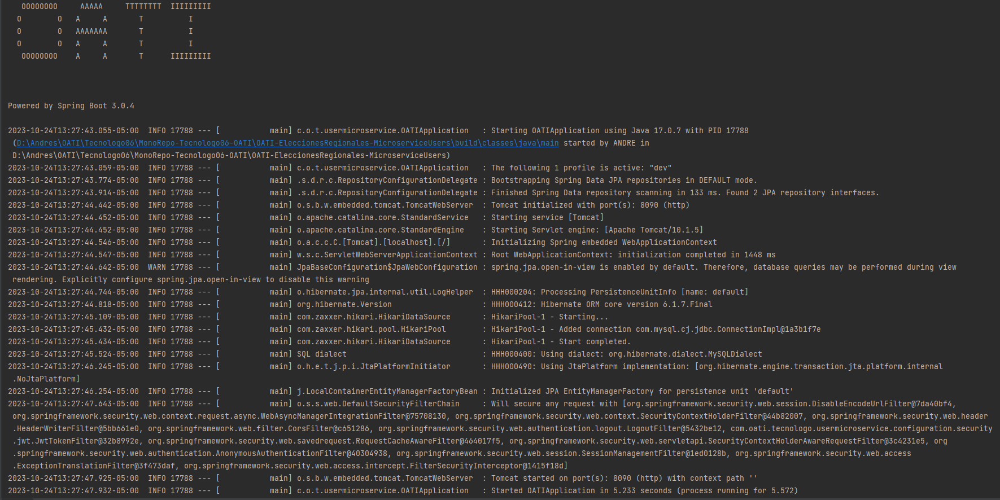
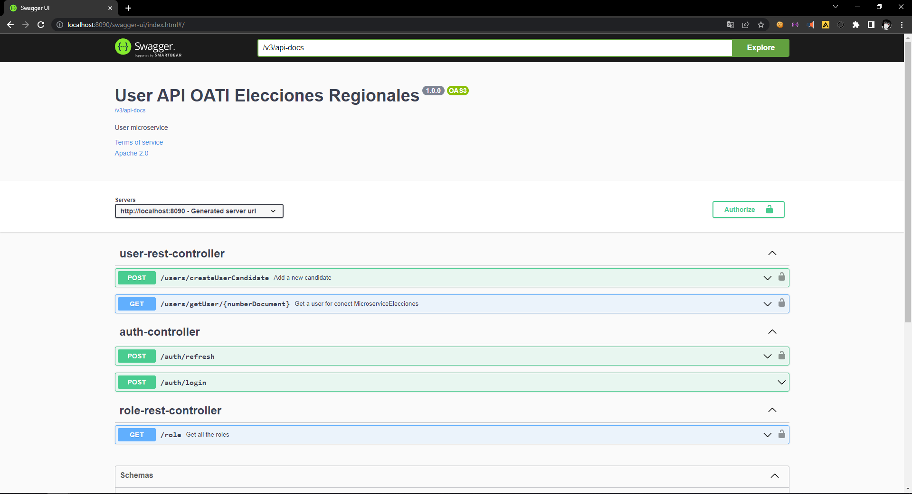
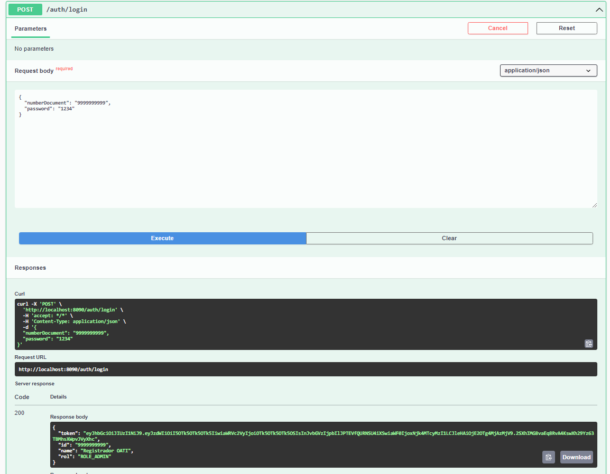
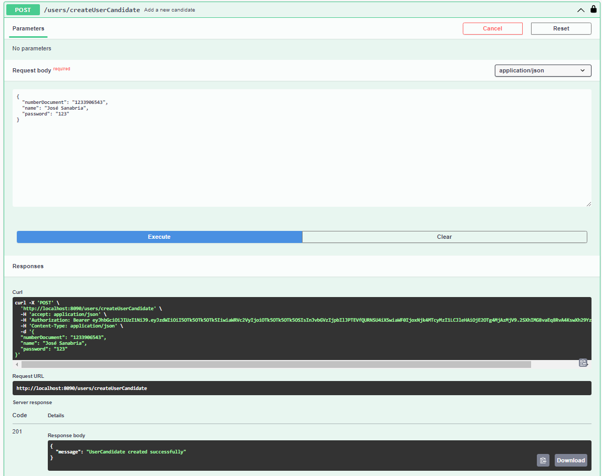
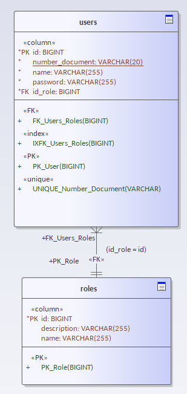

<br />
<div align="center">
<h3 align="center">ELECCIONES REGIONALES</h3>
  <p align="center">
      En este microservicio de usuarios se guarda, modifica y elimina la información de toda usuario que interactua con el sistema de elecciones regionales además de su rol en las mismas, el Admin, Candidato y Ciudadano. Además es el microservicio para generar la autentificación en todo el sistema mediante tokens y está contruido bajo la arquitectura de Puertos y Adaptadores (Hexagonal).
   </p>
</div>

### Construido con

* 
* 
* 
* 


<!-- GETTING STARTED -->
## Getting Started

Para correr de forma local este proyecto verifique la siguiete información y siga los pasos.

### Prerequisitos

* JDK 17 [https://jdk.java.net/java-se-ri/17](https://jdk.java.net/java-se-ri/17)
* Gradle [https://gradle.org/install/](https://gradle.org/install/)
* MySQL [https://dev.mysql.com/downloads/installer/](https://dev.mysql.com/downloads/installer/)

### Herramientas recomendadas
* IntelliJ Community [https://www.jetbrains.com/idea/download/](https://www.jetbrains.com/idea/download/)
* Postman [https://www.postman.com/downloads/](https://www.postman.com/downloads/)

### Instalación
Estando ya ubicado en el microservicio después de clonar el repositorio:
1. Ejecute el script de "scriptCreateDB" en la ubicación (src/main/resources/scriptCreateDB.sql).
4. Actualice la información de la configuración de la conexión de la base de datos
   ```yml
   # src/main/resources/application-dev.yml
   spring:
      datasource:
          url: jdbc:mysql://localhost/elecciones_dbusers
          username: root
          password: <your-password>
   ```
5. Después de que las tablas estén creadas ejecute src/main/resources/scriptInitialDBFill.sql , contiene la un llenado inicial de la base de datos.
6. Abra Swagger UI y busque el endpoint /auth/login para loggearse con la siguientes credenciales; numberDocument: 9999999999, password: 1234 , entrará al usuario Admin.

<!-- USAGE -->
## Utilización

1. Click derecho en la clase OATIApplication y seleccione "Run".
2. Abra [http://localhost:8090/swagger-ui/index.html](http://localhost:8090/swagger-ui/index.html) en su navegador para interactuar con el microservicio de Usuarios.

<!-- ROADMAP -->
## Tests

- Click derecho en la carpeta de test y seleccione Run.

## Funcionalidad




